<p align="center">
  <picture>
    <source media="(prefers-color-scheme: dark)" srcset="docs/assets/readme/banner-dark.png">
    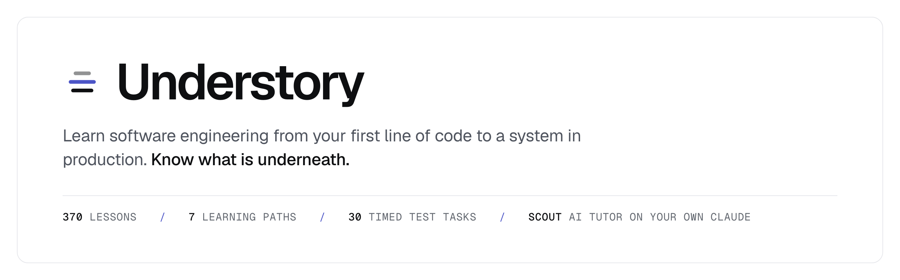
  </picture>
</p>

<p align="center">
  <a href="https://github.com/vieanderes/understory/actions/workflows/ci.yml"></a>
  <a href="#meet-scout-your-ai-tutor"></a>
  
  
  
  
  <a href="#licence"></a>
</p>

<p align="center">
  <a href="#a-note-before-you-start">Why this exists</a> ·
  <a href="#meet-scout-your-ai-tutor">Scout AI</a> ·
  <a href="#start-here">Start here</a> ·
  <a href="#how-it-works">How it works</a> ·
  <a href="#inside-a-lesson">Inside a lesson</a> ·
  <a href="#the-course">The course</a> ·
  <a href="#practise-the-real-test">Practise the real test</a> ·
  <a href="#keep-up-with-the-field">News</a> ·
  <a href="#run-it">Run it</a> ·
  <a href="#contributing">Contributing</a> ·
  <a href="#support">Support</a>
</p>

<br>

## A note before you start

I built Understory for myself. After a long stretch of AI-assisted coding I noticed I was
getting rusty. I could steer an assistant well, but writing, reading and debugging code by
hand had become slower than I liked. So I set out to build a place to practise.

It grew from there. If I was building my own learning platform anyway, I wanted to do it
properly: a course that works for someone writing their first line of code, and still
teaches an experienced engineer something.

Most of all, it became my preparation for interviews in AI engineering and coding in
general. The online-test simulator is built to work the way real assessments do: the same
kind of IDE, one clock that never pauses, hidden tests, an optional built-in AI assistant,
and a report that reads like the reviewer's. I may have overprepared.

Once it had grown into something bigger and useful, I had a real decision to make. I could
keep polishing it on my own and try to build a business around it, or I could open it up
for everyone else to use and improve.

I kept coming back to a feeling most of us know. You find a genuinely good way to learn
something, and then you hit a paywall, a sign-up form or a trial that runs out. That has
always seemed a shame to me. I believe learning should be free, open to everyone, and
something we build together. So I decided to make Understory open source.

It may stay a quiet project that mostly I use, and I would be happy with that. But I hope
some of you find it useful, see what it could become, and make it part of how you learn. If
you would like to help build it, you are very welcome.

If it helps you learn something new, prepare for an interview, or feel at home in your own
code again after a stretch of vibe coding, it has done what I built it for.

And yes, I built it with AI assistance. Avoiding AI was never the goal. Understanding the
code underneath is, whoever or whatever wrote it.

> In a randomised trial with 52 engineers, the group that coded with AI assistance scored
> **50%** on a comprehension quiz. The group that coded by hand scored **67%**, with no
> significant gain in speed. The loss sat in conceptual understanding, code reading and
> debugging.
> <sub>Shen and Tamkin 2026, [arXiv 2601.20245](https://arxiv.org/abs/2601.20245)</sub>

Understory trains exactly those skills: reading, tracing, debugging, reviewing AI-written
code and explaining it. It is one course, from your first `console.log` to a system under
load, with spaced practice so you keep what you learn, and an AI tutor that teaches instead
of answering for you.

Every exercise runs in the browser. JavaScript and TypeScript run in a sandbox, Python runs
on Pyodide, and SQL runs on a real Postgres compiled to WebAssembly. There is no account and
no server holding your progress. It works offline and on a phone.

<p align="center">
  <picture>
    <source media="(prefers-color-scheme: dark)" srcset="docs/assets/readme/home-dark.png">
    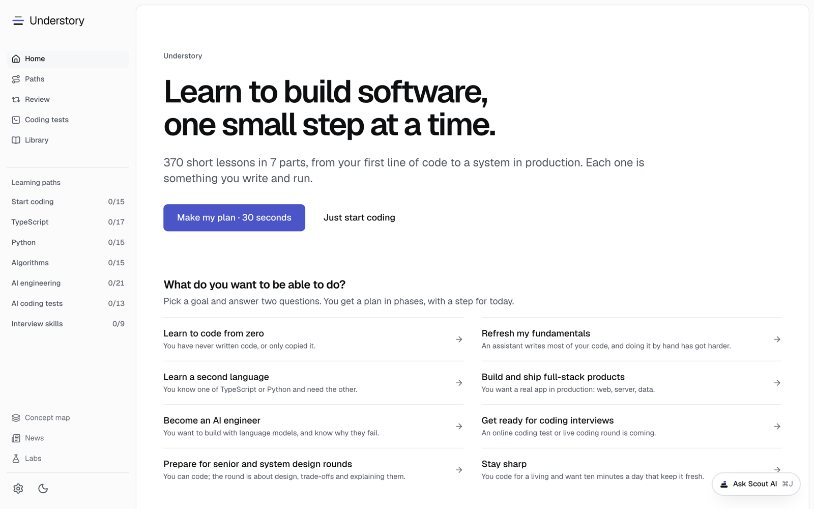
  </picture>
</p>

## Meet Scout, your AI tutor

Scout AI is on every page, one click or <kbd>⌘</kbd> <kbd>J</kbd> (<kbd>Ctrl</kbd> <kbd>J</kbd>)
away. In a lesson it sees the step on your screen, your code and your last run, so you never
paste anything in. Ask it to explain the step in plain
words, show a smaller example, say why something works, or give you a hint without the
answer. It replies with short explanations and highlighted code you can copy.

<picture>
  <source media="(prefers-color-scheme: dark)" srcset="docs/assets/readme/scout-dark.png">
  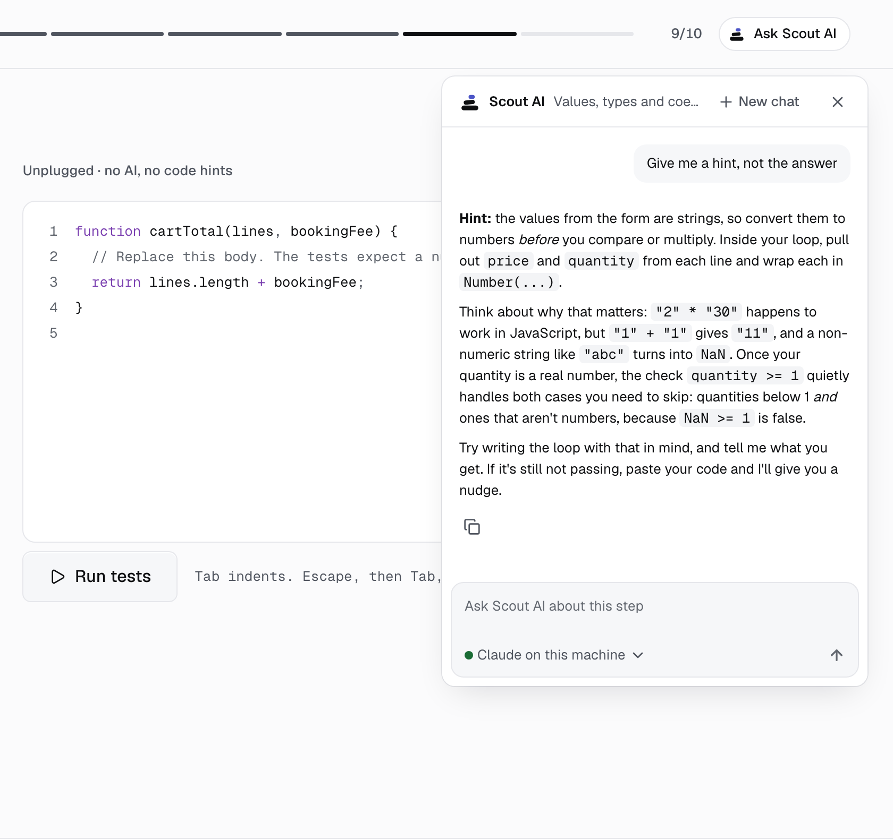
</picture>

It is built to keep you thinking. On an exercise it gives a hint first, then a nudge, and
the full answer only when you ask. It stays out of timed exams, checkpoints and test-outs,
which measure what you know without help. Away from a lesson it is a guide: ask where to
start or which option on a page fits you. In the coding
simulator the same assistant plays the one employers switch on, and every prompt goes into
your report.

### It runs on your own Claude

Scout has no key of its own and no bill to pass on. It uses the Claude you already have,
connected one of three ways:

- **Claude Code on your machine.** Nothing to set up. Run Understory locally (`pnpm dev`)
  with Claude Code logged in, and pick "Your Claude account, here" in Scout.
- **Your Claude account, through MCP.** Connect once. In Claude Code:

  ```sh
  claude mcp add --transport http understory <site>/api/mcp
  ```

  Or, in Claude on the web, desktop or phone, add `<site>/api/mcp` as a custom connector
  (this needs a deployed site; the Claude apps cannot reach localhost). Then ask in Scout
  and tell Claude the pairing code Scout shows.

- **Your Anthropic API key.** Paste it into Scout. It stays in your browser, and the server
  passes each request on without storing the key.

The details, including the shared store a serverless host needs for MCP, are in
[`ONLINE-TEST.md`](docs/ONLINE-TEST.md), section 6.

## Start here

Answer three questions and get a plan: what you want to be able to do, how much time you
have each week, and where you are starting from. The plan comes in phases drawn from the
learning paths, with one step for today and an exam at the end of each phase.

<picture>
  <source media="(prefers-color-scheme: dark)" srcset="docs/assets/readme/plan-dark.png">
  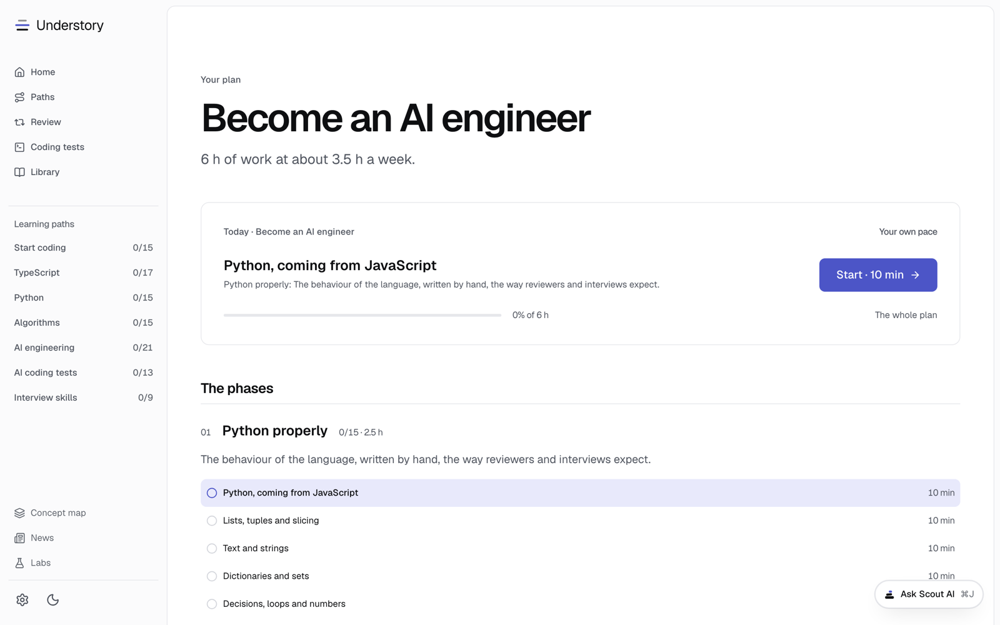
</picture>

Or pick a learning path yourself. Each one is three or four stages of lessons from the full
course, and ends in a timed final exam and a certificate.

| If this is you                                               | Take this path                                                      | Lessons | You leave able to                                                             |
| ------------------------------------------------------------ | ------------------------------------------------------------------- | :-----: | ----------------------------------------------------------------------------- |
| You have never written code, or only copied it               | [Start coding](content/tracks/start-coding.yaml)                    |   15    | Write, run and fix small programs, then put one on a web page                 |
| You let an assistant write your JavaScript for a while       | [TypeScript](content/tracks/javascript-typescript.yaml)             |   17    | Write correct TypeScript by hand again                                        |
| Your next role or round uses Python                          | [Python](content/tracks/python.yaml)                                |   15    | Write clean, typed Python by hand                                             |
| Someone will watch you solve a problem live                  | [Algorithms and coding patterns](content/tracks/coding-rounds.yaml) |   15    | Recognise the pattern behind a question and code it cleanly, out loud         |
| The role is about building products on language models       | [AI engineering](content/tracks/ai-engineering.yaml)                |   21    | Build a RAG pipeline, a production model client and an agent loop             |
| Your next step is an online coding test with an AI assistant | [AI-assisted coding tests](content/tracks/ai-coding-tests.yaml)     |   13    | Solve timed tasks against hidden tests, with the AI as an assistant you steer |
| You have rounds that are about talking, not coding           | [Interviews and system design](content/tracks/interview-loop.yaml)  |    9    | Talk through your work, design a system and answer behavioural questions      |

Not sure where you stand? The placement test at `/start` climbs 30 questions from first
steps to race conditions and prompt injection, and tells you where to begin.

## How it works

|              | What you do                                                                                         | What is underneath                                                                                                                         |
| ------------ | --------------------------------------------------------------------------------------------------- | ------------------------------------------------------------------------------------------------------------------------------------------ |
| **Plan**     | Pick a goal, your time and your starting point. Get phases and a step for today.                    | Built from the learning paths and your progress; answers and progress live in the event log on your device.                                |
| **Learn**    | Short lessons, one idea per screen. An explanation first, then you build, fix, predict or review.   | 370 lessons in 30 chapters. Every exercise has a solution that the build runs against its own tests before it ships.                       |
| **Ask**      | Scout AI beside any lesson or page, on your own Claude.                                             | It reads the step on screen, answers in Markdown with highlighted code, and never sits in an exam.                                         |
| **Practise** | Spaced, mixed review sessions, sized before you start. A concept map that fades as memory does.     | FSRS scheduling, a mastery model per concept and confidence ratings on each answer. See [`LEARNING-SCIENCE.md`](docs/LEARNING-SCIENCE.md). |
| **Rehearse** | Timed online coding tests in a simulator, with an optional guided mode.                             | 30 original tasks with hidden correctness and performance tests. See [Practise the real test](#practise-the-real-test).                    |
| **Prove it** | A checkpoint and capstone at the end of each part. A final exam at the end of each path.            | Capstones come with worked solutions, each built and tested as a real project.                                                             |
| **Read**     | Every lesson as a lecture: the explanation, worked examples, every solution, the lines to remember. | Readable per lesson, chapter, part or path. Downloadable as PDF and as an audiobook with chapters.                                         |
| **Keep up**  | A daily digest of software and AI news, each item linked to the lessons underneath it.              | 41 verified feeds, fetched by a scheduled GitHub Action. See [Keep up with the field](#keep-up-with-the-field).                            |

Nothing in the course asks you to do arithmetic in your head. Every scored step asks you to
do something a working engineer does: write code, fix it, read it, review it or decide.

## Inside a lesson

A lesson is a sequence of steps. There are 13 kinds, and at least half the scored steps in
every lesson are active: you write or change something and it runs.

**Code challenges** run against hidden tests, in JavaScript, TypeScript or Python. Unplugged steps switch off autocomplete, so the answer is yours. Each hint lowers the score.

<picture>
  <source media="(prefers-color-scheme: dark)" srcset="docs/assets/readme/challenge-dark.png">
  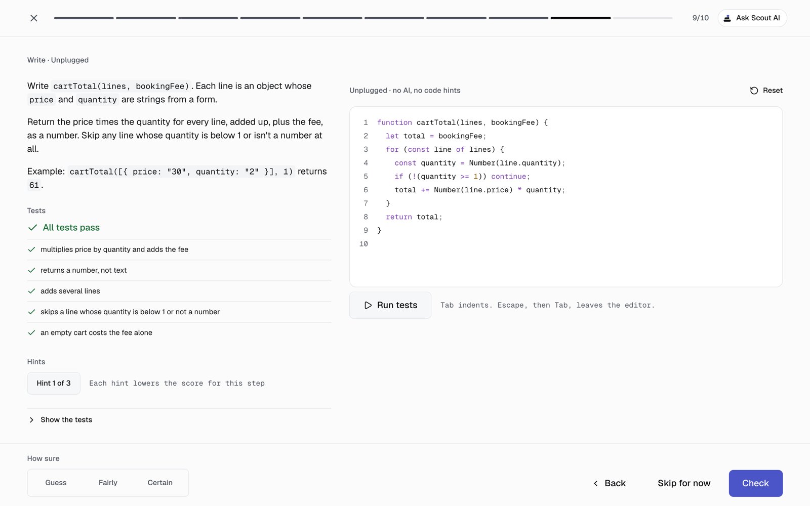
</picture>

**Playgrounds** render HTML, CSS, JavaScript and React as you type, and check the page itself: its elements, its text, what happens on a click.

<picture>
  <source media="(prefers-color-scheme: dark)" srcset="docs/assets/readme/playground-dark.png">
  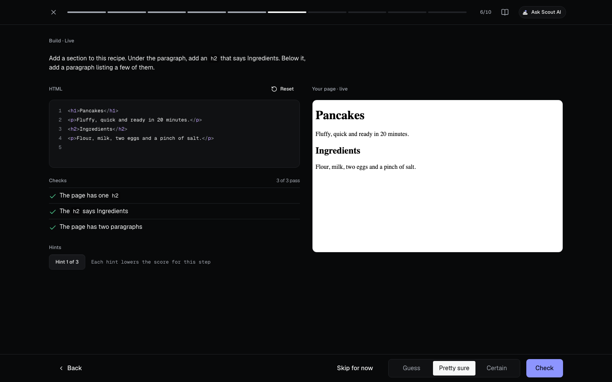
</picture>

**SQL steps** run on Postgres 18 in the browser. The errors are the real ones, so reading them is part of the lesson.

<picture>
  <source media="(prefers-color-scheme: dark)" srcset="docs/assets/readme/sql-dark.png">
  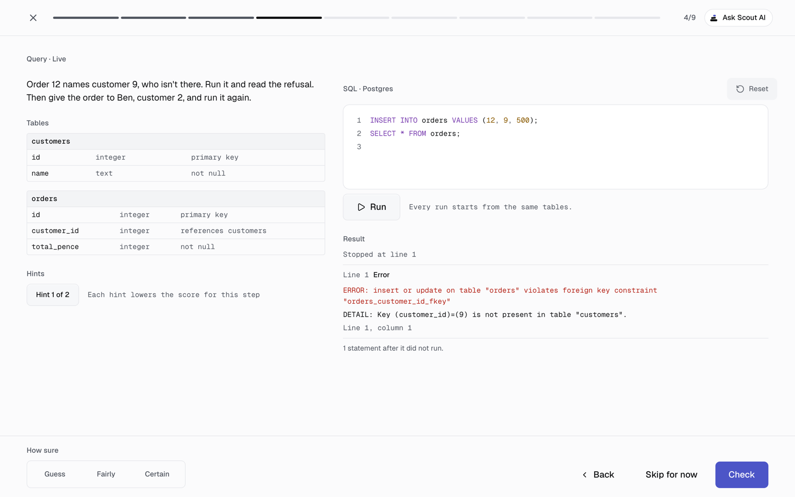
</picture>

**Labs** are simulations you step through, for the mechanisms a playground cannot show: the event loop, a B-tree lookup, two buyers and one ticket.

<picture>
  <source media="(prefers-color-scheme: dark)" srcset="docs/assets/readme/lab-dark.png">
  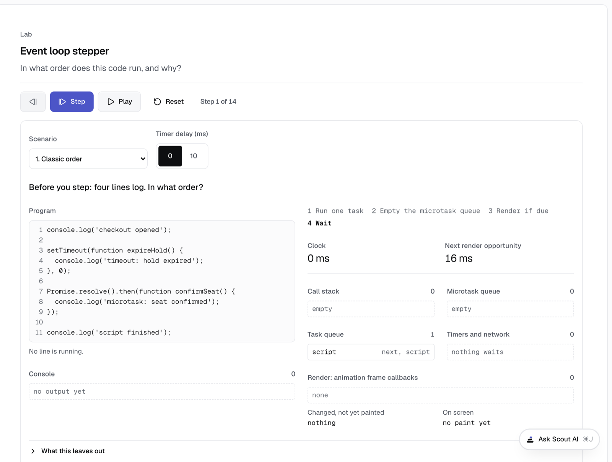
</picture>

<details>
<summary><b>All 13 step types</b></summary>

| Step              | What the learner does                                                                  |
| ----------------- | -------------------------------------------------------------------------------------- |
| `prose`           | Reads one idea, with an example and a figure where it helps                            |
| `code-challenge`  | Writes code against tests, in JavaScript, TypeScript or Python, often in two languages |
| `playground`      | Builds a live page in HTML, CSS, JavaScript or React, checked on a fresh render        |
| `sql`             | Queries and changes a real Postgres database                                           |
| `bug-hunt`        | Finds and fixes the bug in working-looking code                                        |
| `ai-review`       | Reviews code an assistant wrote and points to the line that is wrong                   |
| `predict-output`  | Says what code prints before running it                                                |
| `trace-table`     | Follows variables through a loop, a row at a time                                      |
| `parsons`         | Puts shuffled lines of a solution in order                                             |
| `fill-blank`      | Completes the missing piece of a snippet                                               |
| `multiple-choice` | Chooses between answers, with feedback on each wrong one                               |
| `explain-back`    | Explains a cause in their own words, then marks it against three key points            |
| `lab`             | Steps through a simulation                                                             |

</details>

### Built for a phone as much as a desk

Every screen is designed from 390 px up and checked at 390, 768, 1024 and 1440 px, in light
and dark. Writing code on a phone gets its own editor: a suggestion row above the keyboard,
snippet gaps you tap to fill, trackpad-style cursor keys and a full-screen mode. See
[`MOBILE-EDITING.md`](docs/MOBILE-EDITING.md). Scout opens as a sheet over the lesson.

<p align="center">
  <picture>
    <source media="(prefers-color-scheme: dark)" srcset="docs/assets/readme/phone-home-dark.png">
    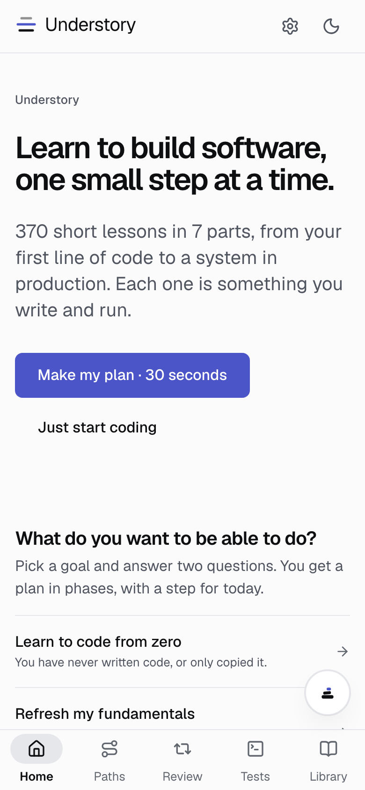
  </picture>
  &nbsp;
  <picture>
    <source media="(prefers-color-scheme: dark)" srcset="docs/assets/readme/phone-plan-dark.png">
    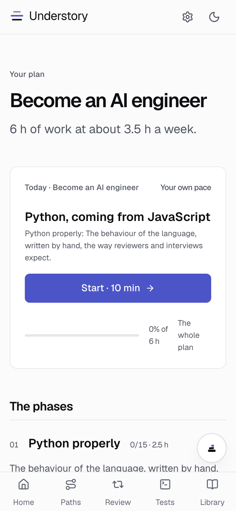
  </picture>
  &nbsp;
  <picture>
    <source media="(prefers-color-scheme: dark)" srcset="docs/assets/readme/phone-scout-dark.png">
    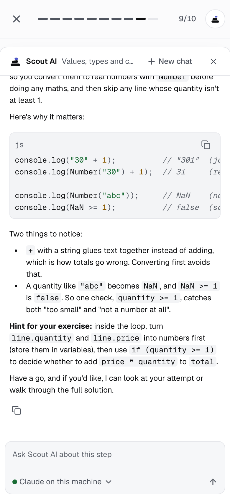
  </picture>
</p>

## The course

Seven parts, each ending in a checkpoint and a capstone project. Four more chapters are woven
through them: CS fundamentals, clean code, professional habits and Next.js on the server
appear right after the lesson they build on.

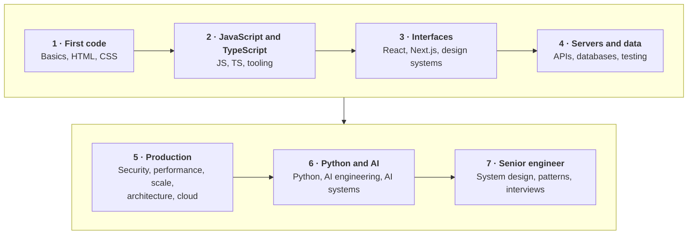

About 67 hours of lessons, 246 of them marked essential and 124 advanced. The advanced ones
can wait for a second pass. The full map, with the reason each chapter matters, is in
[`docs/CURRICULUM.md`](docs/CURRICULUM.md).

<details>
<summary><b>Part 1 · First code</b> · 31 lessons · 5 h 7 min · capstone: A reading list page</summary>

| Chapter                                                    | Lessons | You can build                                                                       |
| ---------------------------------------------------------- | ------: | ----------------------------------------------------------------------------------- |
| 00 · [First steps in JavaScript](content/course/00-basics) |      11 | A small to-do list program, written from scratch.                                   |
| 01 · [HTML](content/course/01-html)                        |       7 | A well-structured page with links, images and a form that works without JavaScript. |
| 02 · [CSS](content/course/02-css)                          |      13 | A responsive page with a nav bar, a card grid, and a light and a dark theme.        |

<details>
<summary>00 · First steps in JavaScript</summary>

1. [Your first line of code](content/course/00-basics/01-your-first-line-of-code)
2. [Variables](content/course/00-basics/02-variables)
3. [Maths and text](content/course/00-basics/03-maths-and-text)
4. [Making decisions](content/course/00-basics/04-making-decisions)
5. [Repeating things](content/course/00-basics/05-repeating-things)
6. [Functions](content/course/00-basics/06-functions)
7. [Lists](content/course/00-basics/07-lists)
8. [Objects](content/course/00-basics/08-objects)
9. [Errors and stack traces](content/course/00-basics/09-errors-and-stack-traces)
10. [Watching code run](content/course/00-basics/10-watching-code-run)
11. [A small program](content/course/00-basics/11-a-small-program)

</details>

<details>
<summary>01 · HTML</summary>

1. [Your first web page](content/course/01-html/01-your-first-web-page)
2. [Lists, links and images](content/course/01-html/02-lists-links-and-images)
3. [The DOM](content/course/01-html/03-the-dom)
4. [Semantic structure](content/course/01-html/04-semantic-structure)
5. [Links and URLs](content/course/01-html/05-links-urls-and-navigation)
6. [Forms](content/course/01-html/06-forms-and-native-validation)
7. [Images and the head](content/course/01-html/07-media-responsive-images-and-the-head)

</details>

<details>
<summary>02 · CSS</summary>

1. [What CSS is](content/course/02-css/01-what-css-is)
2. [Selectors and the cascade](content/course/02-css/02-selectors-and-the-cascade)
3. [The box model](content/course/02-css/03-the-box-model)
4. [Block, inline and display](content/course/02-css/04-display-and-flow)
5. [Flexbox](content/course/02-css/05-flexbox)
6. [Grid](content/course/02-css/06-grid)
7. [Positioning and z-index](content/course/02-css/07-positioning-and-z-index)
8. [Units and responsive design](content/course/02-css/08-responsive-design)
9. [Custom properties](content/course/02-css/09-custom-properties)
10. [Text and fonts](content/course/02-css/10-text-and-fonts)
11. [Transitions and transforms](content/course/02-css/11-transitions)
12. [Build a page](content/course/02-css/12-build-a-page)
13. [Modern CSS architecture](content/course/02-css/13-modern-css-architecture) <sub>advanced</sub>

</details>

</details>

<details>
<summary><b>Part 2 · JavaScript and TypeScript</b> · 39 lessons · 6 h 30 min · capstone: A typed shopping cart</summary>

| Chapter                                         | Lessons | You can build                                                                                                          |
| ----------------------------------------------- | ------: | ---------------------------------------------------------------------------------------------------------------------- |
| 03 · [JavaScript](content/course/03-javascript) |      19 | A live search page that fetches results as you type, built in the browser.                                             |
| 04 · [TypeScript](content/course/04-typescript) |       9 | A typed data model with a parser that checks data where it enters.                                                     |
| 05 · [Tooling](content/course/05-tooling)       |      11 | A project you run with Node, install packages into, save in Git and share for review, with a lint and type-check gate. |

<details>
<summary>03 · JavaScript</summary>

1. [JavaScript meets the page](content/course/03-javascript/01-javascript-meets-the-page)
2. [Values, types and coercion](content/course/03-javascript/02-values-types-coercion)
3. [The built-in toolbox](content/course/03-javascript/03-the-built-in-toolbox)
4. [Everyday syntax](content/course/03-javascript/04-everyday-syntax)
5. [Destructuring, spread and defaults](content/course/03-javascript/05-destructuring-and-spread)
6. [Arrays and iteration](content/course/03-javascript/06-arrays-and-iteration)
7. [Variables, scope and closures](content/course/03-javascript/07-scope-and-closures)
8. [References, copying and immutability](content/course/03-javascript/08-references-copying-and-immutability)
9. [Errors](content/course/03-javascript/09-control-flow-and-errors)
10. [Changing the page](content/course/03-javascript/10-changing-the-page)
11. [Events](content/course/03-javascript/11-dom-and-events)
12. [Classes and prototypes](content/course/03-javascript/12-objects-prototypes-and-classes)
13. [Functions and `this`](content/course/03-javascript/13-functions-and-this)
14. [Modules](content/course/03-javascript/14-modules)
15. [Promises and async/await](content/course/03-javascript/15-promises-and-async-await)
16. [The event loop](content/course/03-javascript/16-the-event-loop)
17. [Browsers, servers and requests](content/course/03-javascript/17-requests-and-responses)
18. [Fetching data](content/course/03-javascript/18-fetch-cancellation-and-timeouts)
19. [Build a live search](content/course/03-javascript/19-build-a-live-search)

</details>

<details>
<summary>04 · TypeScript</summary>

1. [What TypeScript is](content/course/04-typescript/01-what-typescript-is)
2. [Typing everyday code](content/course/04-typescript/02-typing-everyday-code)
3. [Structural typing](content/course/04-typescript/03-structural-typing)
4. [Unions and narrowing](content/course/04-typescript/04-unions-and-narrowing)
5. [Typing the boundary](content/course/04-typescript/05-typing-the-boundary)
6. [Generics](content/course/04-typescript/06-generics)
7. [Deriving types](content/course/04-typescript/07-deriving-types)
8. [Strictness and escape hatches](content/course/04-typescript/08-strictness)
9. [TypeScript in a project](content/course/04-typescript/09-typescript-in-a-project) <sub>advanced</sub>

</details>

<details>
<summary>05 · Tooling</summary>

1. [The terminal](content/course/05-tooling/01-the-terminal)
2. [Pipes, redirection and exit codes](content/course/05-tooling/02-pipes-redirection-and-exit-codes)
3. [What Node is](content/course/05-tooling/03-what-node-is)
4. [npm and packages](content/course/05-tooling/04-node-and-npm)
5. [Git from zero](content/course/05-tooling/05-git-from-zero)
6. [Branches and merging](content/course/05-tooling/06-git-as-a-graph)
7. [Remotes and pull requests](content/course/05-tooling/07-remotes-and-pull-requests)
8. [Working with AI without losing skill](content/course/05-tooling/08-working-with-ai)
9. [What a build does](content/course/05-tooling/09-what-a-build-does)
10. [Quality gates](content/course/05-tooling/10-quality-gates)
11. [Configuration and environment](content/course/05-tooling/11-configuration-and-environment)

</details>

</details>

<details>
<summary><b>Part 3 · Interfaces</b> · 30 lessons · 5 h · capstone: A small storefront</summary>

| Chapter                                                                                     | Lessons | You can build                                                                                                            |
| ------------------------------------------------------------------------------------------- | ------: | ------------------------------------------------------------------------------------------------------------------------ |
| 06 · [React](content/course/06-react)                                                       |      15 | A small React app with a form, a filtered list and data loaded from a server, each piece of state in the right place.    |
| 07 · [Next.js](content/course/07-nextjs)                                                    |       6 | A Next.js site with several pages, a shared layout, a search box that runs in the browser and data loaded on the server. |
| 08 · [Accessibility and design systems](content/course/08-design-systems-and-accessibility) |       9 | An accessible form, a themed component library with variants, and a dialog that handles focus.                           |

<details>
<summary>06 · React</summary>

1. [What React is](content/course/06-react/01-what-react-is)
2. [Props and children](content/course/06-react/02-props-and-children)
3. [State and events](content/course/06-react/03-state-and-events)
4. [UI as a function of state](content/course/06-react/04-ui-as-a-function-of-state)
5. [State as a snapshot](content/course/06-react/05-state-as-a-snapshot)
6. [Lists and keys](content/course/06-react/06-lists-and-keys)
7. [Updating objects and arrays](content/course/06-react/07-updating-objects-and-arrays)
8. [Sharing state](content/course/06-react/08-sharing-state)
9. [Forms](content/course/06-react/09-forms)
10. [Effects](content/course/06-react/10-effects)
11. [Fetching data](content/course/06-react/11-fetching-data)
12. [Reducers and URL state](content/course/06-react/12-reducers-and-url-state)
13. [Build a small app](content/course/06-react/13-build-a-small-app)
14. [Refs and custom hooks](content/course/06-react/14-refs-and-custom-hooks) <sub>advanced</sub>
15. [Performance](content/course/06-react/15-performance) <sub>advanced</sub>

</details>

<details>
<summary>07 · Next.js</summary>

1. [What Next.js adds](content/course/07-nextjs/01-what-nextjs-adds)
2. [Pages, layouts and links](content/course/07-nextjs/02-app-router)
3. [Server and Client Components](content/course/07-nextjs/03-server-and-client-components)
4. [Loading data on the server](content/course/07-nextjs/04-loading-data)
5. [Static and dynamic pages](content/course/07-nextjs/05-the-rendering-spectrum)
6. [Content sites and static export](content/course/07-nextjs/06-content-driven-and-static-sites)

</details>

<details>
<summary>08 · Accessibility and design systems</summary>

1. [Who accessibility is for](content/course/08-design-systems-and-accessibility/01-who-accessibility-is-for)
2. [Keyboard and focus](content/course/08-design-systems-and-accessibility/02-keyboard-and-focus)
3. [Contrast, colour and motion](content/course/08-design-systems-and-accessibility/03-contrast-colour-and-motion)
4. [Design systems and tokens](content/course/08-design-systems-and-accessibility/04-design-tokens)
5. [Components with good APIs](content/course/08-design-systems-and-accessibility/05-component-apis-and-variants)
6. [Utility-first CSS with Tailwind](content/course/08-design-systems-and-accessibility/06-utility-first-css)
7. [Accessible widgets](content/course/08-design-systems-and-accessibility/07-accessible-widgets)
8. [Forms that help](content/course/08-design-systems-and-accessibility/08-forms-that-help)
9. [Internationalisation](content/course/08-design-systems-and-accessibility/09-internationalisation) <sub>advanced</sub>

</details>

</details>

<details>
<summary><b>Part 4 · Servers and data</b> · 43 lessons · 7 h 4 min · capstone: A booking API</summary>

| Chapter                                                                  | Lessons | You can build                                                                                                                                              |
| ------------------------------------------------------------------------ | ------: | ---------------------------------------------------------------------------------------------------------------------------------------------------------- |
| 09 · [Backend, APIs, auth, payments](content/course/09-backend-and-apis) |      17 | An API with validated endpoints, sessions, ownership checks, rate limits, and an idempotent payment webhook handler.                                       |
| 10 · [Databases](content/course/10-databases)                            |      16 | A schema with keys and constraints, safe queries from code, an index that fixes a slow page, a transaction that can't half-happen, and row-level security. |
| 11 · [Testing](content/course/11-testing)                                |      10 | A test suite with unit tests, integration tests on a real database, one end-to-end journey and a load test.                                                |

<details>
<summary>09 · Backend, APIs, auth, payments</summary>

1. [What a backend is](content/course/09-backend-and-apis/01-what-a-backend-is)
2. [How a page reaches you](content/course/09-backend-and-apis/02-how-a-page-reaches-you)
3. [Your first endpoint](content/course/09-backend-and-apis/03-your-first-endpoint)
4. [Methods and status codes](content/course/09-backend-and-apis/04-http-in-depth)
5. [API design](content/course/09-backend-and-apis/05-api-design)
6. [Errors clients can use](content/course/09-backend-and-apis/06-error-responses)
7. [Validation at the trust boundary](content/course/09-backend-and-apis/07-validation-and-the-trust-boundary)
8. [Sessions, cookies and tokens](content/course/09-backend-and-apis/08-sessions-cookies-and-tokens)
9. [Authorisation](content/course/09-backend-and-apis/09-authorisation)
10. [Signing in with another account](content/course/09-backend-and-apis/10-oauth-oidc-and-passkeys) <sub>advanced</sub>
11. [Calling other APIs from your server](content/course/09-backend-and-apis/11-calling-other-apis)
12. [Rate limits](content/course/09-backend-and-apis/12-rate-limits)
13. [Webhooks](content/course/09-backend-and-apis/13-webhooks)
14. [Payments with Stripe](content/course/09-backend-and-apis/14-payments-with-stripe)
15. [Files and object storage](content/course/09-backend-and-apis/15-files-and-object-storage) <sub>advanced</sub>
16. [Realtime and streaming](content/course/09-backend-and-apis/16-realtime) <sub>advanced</sub>
17. [Changing an API safely](content/course/09-backend-and-apis/17-api-evolution) <sub>advanced</sub>

</details>

<details>
<summary>10 · Databases</summary>

1. [What a database is](content/course/10-databases/01-what-a-database-is)
2. [Finding the rows you want](content/course/10-databases/02-reading-rows)
3. [Adding, changing and deleting rows](content/course/10-databases/03-changing-rows)
4. [Keys and relations](content/course/10-databases/04-the-relational-model)
5. [Joining tables](content/course/10-databases/05-sql-queries)
6. [Counting and grouping](content/course/10-databases/06-counting-and-grouping)
7. [Designing tables](content/course/10-databases/07-schema-design-in-practice)
8. [Querying from code](content/course/10-databases/08-querying-from-code)
9. [Indexes](content/course/10-databases/09-indexes)
10. [Reading `EXPLAIN`](content/course/10-databases/10-reading-explain) <sub>advanced</sub>
11. [Transactions](content/course/10-databases/11-transactions-and-acid)
12. [Constraints as the last line of defence](content/course/10-databases/12-constraints-as-the-last-line-of-defence)
13. [Two writers at once](content/course/10-databases/13-isolation-levels-and-anomalies) <sub>advanced</sub>
14. [Migrations](content/course/10-databases/14-migrations)
15. [Row-level security and the Supabase model](content/course/10-databases/15-row-level-security-and-the-supabase-model)
16. [Scaling a database](content/course/10-databases/16-storage-pooling-and-redis) <sub>advanced</sub>

</details>

<details>
<summary>11 · Testing</summary>

1. [Your first test](content/course/11-testing/01-your-first-test)
2. [What to test](content/course/11-testing/02-what-to-test)
3. [Unit tests](content/course/11-testing/03-unit-tests)
4. [The TDD loop](content/course/11-testing/04-the-tdd-loop)
5. [Test doubles and integration](content/course/11-testing/05-test-doubles-and-integration)
6. [Testing a component](content/course/11-testing/06-testing-a-component)
7. [End-to-end with Playwright](content/course/11-testing/07-end-to-end-with-playwright)
8. [Property-based and concurrency tests](content/course/11-testing/08-property-based-and-concurrency-tests) <sub>advanced</sub>
9. [Load testing with k6](content/course/11-testing/09-load-testing-with-k6) <sub>advanced</sub>
10. [Contract tests](content/course/11-testing/10-contract-tests) <sub>advanced</sub>

</details>

</details>

<details>
<summary><b>Part 5 · Production</b> · 69 lessons · 11 h 29 min · capstone: The booking API in production</summary>

| Chapter                                                               | Lessons | You can build                                                                                                                                                     |
| --------------------------------------------------------------------- | ------: | ----------------------------------------------------------------------------------------------------------------------------------------------------------------- |
| 12 · [Security](content/course/12-security)                           |      18 | A threat model, a page that shows hostile input as text, safe cookie and CORS settings, access-control tests, safe uploads, and an audit of a small app.          |
| 13 · [Performance](content/course/13-performance)                     |      10 | A page and an API measured before and after: no blocking scripts, no jumping content, no leaks, honest caches and one query instead of 201.                       |
| 14 · [Concurrency and scale](content/course/14-concurrency-and-scale) |      10 | A batched, rate-safe pipeline of model calls, an idempotent payment endpoint, a queue worker for long AI jobs, and a scheduled job that runs once across servers. |
| 15 · [Architecture](content/course/15-architecture)                   |      12 | A modular monolith refactored under tests, with thin handlers, ports for storage and the model, an outbox, and decision records.                                  |
| 16 · [Cloud and DevOps](content/course/16-cloud-and-devops)           |      19 | A model-backed API in a container behind a reverse proxy, deployed by a pipeline with a rollback, with logs, metrics, alerts and a tested restore.                |

<details>
<summary>12 · Security</summary>

1. [What attackers want](content/course/12-security/01-threat-modelling)
2. [Cross-site scripting and CSP](content/course/12-security/02-xss-csp-and-security-headers)
3. [CSRF and SameSite cookies](content/course/12-security/03-csrf-samesite-and-cors)
4. [Same-origin policy and CORS](content/course/12-security/04-same-origin-policy-and-cors)
5. [Injection and SSRF](content/course/12-security/05-injection-and-ssrf)
6. [Broken authentication and access control](content/course/12-security/06-broken-authentication-and-access-control)
7. [Hashing and passwords](content/course/12-security/07-cryptography-for-engineers)
8. [Encryption, signatures and TLS](content/course/12-security/08-encryption-signatures-and-tls) <sub>advanced</sub>
9. [Secrets and key management](content/course/12-security/09-secrets-and-key-management)
10. [JWT pitfalls](content/course/12-security/10-jwt-pitfalls) <sub>advanced</sub>
11. [File uploads and path traversal](content/course/12-security/11-file-uploads-and-path-traversal)
12. [Abuse, bots and privacy](content/course/12-security/12-abuse-bots-and-privacy) <sub>advanced</sub>
13. [Detection and logging](content/course/12-security/13-detection-and-logging)
14. [Incident response](content/course/12-security/14-incident-response) <sub>advanced</sub>
15. [Defence in depth and zero trust](content/course/12-security/15-defence-in-depth-and-zero-trust)
16. [Attacking your own app, legally](content/course/12-security/16-the-attackers-playbook)
17. [When a dependency turns malicious](content/course/12-security/17-supply-chain) <sub>advanced</sub>
18. [Capstone: audit an app](content/course/12-security/18-owasp-top-ten)

</details>

<details>
<summary>13 · Performance</summary>

1. [Measure first](content/course/13-performance/01-measure-first)
2. [How fast a page feels](content/course/13-performance/02-how-fast-a-page-feels)
3. [What keeps the screen blank](content/course/13-performance/03-the-critical-rendering-path)
4. [The cost of JavaScript](content/course/13-performance/04-the-cost-of-javascript)
5. [Shipping less JavaScript](content/course/13-performance/05-shipping-less-javascript)
6. [Smooth animation](content/course/13-performance/06-smooth-animation) <sub>advanced</sub>
7. [Memory leaks](content/course/13-performance/07-memory-leaks)
8. [Caching in the browser and CDN](content/course/13-performance/08-caching-in-the-browser-and-cdn)
9. [Caching on the server](content/course/13-performance/09-caching-on-the-server)
10. [Finding a slow request](content/course/13-performance/10-finding-a-slow-request) <sub>advanced</sub>

</details>

<details>
<summary>14 · Concurrency and scale</summary>

1. [Many things at once](content/course/14-concurrency-and-scale/01-many-things-at-once)
2. [How many at once](content/course/14-concurrency-and-scale/02-how-many-at-once)
3. [CPU work off the main thread](content/course/14-concurrency-and-scale/03-cpu-work-off-the-main-thread) <sub>advanced</sub>
4. [Race conditions](content/course/14-concurrency-and-scale/04-race-conditions)
5. [Optimistic locking](content/course/14-concurrency-and-scale/05-optimistic-locking) <sub>advanced</sub>
6. [Holds that expire](content/course/14-concurrency-and-scale/06-holds-that-expire) <sub>advanced</sub>
7. [Idempotency](content/course/14-concurrency-and-scale/07-idempotency) <sub>advanced</sub>
8. [Queues and workers](content/course/14-concurrency-and-scale/08-queues-and-workers) <sub>advanced</sub>
9. [Scheduled jobs](content/course/14-concurrency-and-scale/09-scheduled-jobs) <sub>advanced</sub>
10. [Failure handling](content/course/14-concurrency-and-scale/10-failure-handling) <sub>advanced</sub>

</details>

<details>
<summary>15 · Architecture</summary>

1. [Coupling, cohesion and information hiding](content/course/15-architecture/01-coupling-cohesion-and-information-hiding)
2. [Organising a codebase](content/course/15-architecture/02-organising-a-codebase)
3. [Monorepos and workspaces](content/course/15-architecture/03-monorepos-and-workspaces)
4. [Layers and thin handlers](content/course/15-architecture/04-layers-and-thin-handlers)
5. [Ports and adapters](content/course/15-architecture/05-ports-and-adapters) <sub>advanced</sub>
6. [Where the model call lives](content/course/15-architecture/06-where-the-model-call-lives) <sub>advanced</sub>
7. [Domain modelling](content/course/15-architecture/07-domain-modelling) <sub>advanced</sub>
8. [Monolith or services](content/course/15-architecture/08-monolith-or-services) <sub>advanced</sub>
9. [Events and the outbox](content/course/15-architecture/09-events-and-the-outbox) <sub>advanced</sub>
10. [Read models and event logs](content/course/15-architecture/10-read-models-and-event-logs) <sub>advanced</sub>
11. [Serving many customers](content/course/15-architecture/11-serving-many-customers) <sub>advanced</sub>
12. [Recording decisions](content/course/15-architecture/12-recording-decisions)

</details>

<details>
<summary>16 · Cloud and DevOps</summary>

1. [Where your code runs](content/course/16-cloud-and-devops/01-where-your-code-runs)
2. [A Linux server](content/course/16-cloud-and-devops/02-a-linux-server)
3. [DNS, domains and TLS](content/course/16-cloud-and-devops/03-dns-domains-and-tls)
4. [Containers](content/course/16-cloud-and-devops/04-containers)
5. [Building images you can trust](content/course/16-cloud-and-devops/05-building-images)
6. [Compose and multi-service systems](content/course/16-cloud-and-devops/06-compose-and-multi-service-systems)
7. [Reverse proxies and load balancing](content/course/16-cloud-and-devops/07-reverse-proxies-and-load-balancing)
8. [CI/CD pipelines](content/course/16-cloud-and-devops/08-ci-cd)
9. [Releasing without downtime](content/course/16-cloud-and-devops/09-releasing-without-downtime)
10. [Logs, metrics and traces](content/course/16-cloud-and-devops/10-observability)
11. [Alerts and on-call](content/course/16-cloud-and-devops/11-alerts-and-on-call)
12. [Backups and recovery](content/course/16-cloud-and-devops/12-backups-and-recovery) <sub>advanced</sub>
13. [Choosing where to host](content/course/16-cloud-and-devops/13-hosting-models)
14. [Serverless functions](content/course/16-cloud-and-devops/14-serverless-functions) <sub>advanced</sub>
15. [Edge functions and CDNs](content/course/16-cloud-and-devops/15-edge-functions-and-cdns) <sub>advanced</sub>
16. [Scaling and cost](content/course/16-cloud-and-devops/16-scaling-and-cost) <sub>advanced</sub>
17. [Trunk-based development and progressive delivery](content/course/16-cloud-and-devops/17-progressive-delivery) <sub>advanced</sub>
18. [Infrastructure as code](content/course/16-cloud-and-devops/18-infrastructure-as-code) <sub>advanced</sub>
19. [Kubernetes essentials](content/course/16-cloud-and-devops/19-kubernetes) <sub>advanced</sub>

</details>

</details>

<details>
<summary><b>Part 6 · Python and AI engineering</b> · 51 lessons · 8 h 25 min · capstone: A support assistant</summary>

| Chapter                                                           | Lessons | You can build                                                                                                                                                       |
| ----------------------------------------------------------------- | ------: | ------------------------------------------------------------------------------------------------------------------------------------------------------------------- |
| 18 · [Python](content/course/18-python)                           |      14 | A typed command-line tool that reads a JSON file of eval results and prints a report, with exit codes CI can trust.                                                 |
| 19 · [Python for AI engineering](content/course/19-python-for-ai) |       9 | A FastAPI service that calls a model, validates its reply with Pydantic, streams it, retries on rate limits, and is tested with a fake client.                      |
| 20 · [AI engineering](content/course/20-ai-engineering)           |      14 | A support assistant that answers from your own documents with citations, uses tools through checked code, survives rate limits, and is gated by an eval suite.      |
| 21 · [AI systems in production](content/course/21-ai-systems)     |      14 | A support pipeline where code owns the flow: a classifier routes each ticket, a guarded agent acts, humans approve risky steps, and evals gate every prompt change. |

<details>
<summary>18 · Python</summary>

1. [Python, coming from JavaScript](content/course/18-python/01-first-steps)
2. [Decisions, loops and numbers](content/course/18-python/02-decisions-and-loops)
3. [Text and strings](content/course/18-python/03-text-and-strings)
4. [Lists, tuples and slicing](content/course/18-python/04-lists-and-tuples)
5. [Dictionaries and sets](content/course/18-python/05-dicts-and-sets)
6. [Functions](content/course/18-python/06-functions)
7. [Functions as values](content/course/18-python/07-functions-as-values)
8. [Comprehensions and iteration](content/course/18-python/08-comprehensions)
9. [Exceptions and tracebacks](content/course/18-python/09-errors-and-files)
10. [Files, with and JSON](content/course/18-python/10-files-and-json)
11. [Classes and dataclasses](content/course/18-python/11-classes)
12. [Projects, packages and uv](content/course/18-python/12-projects-and-uv)
13. [Type hints](content/course/18-python/13-type-hints)
14. [Build a report tool](content/course/18-python/14-build-a-report-tool)

</details>

<details>
<summary>19 · Python for AI engineering</summary>

1. [Your first model call](content/course/19-python-for-ai/01-your-first-model-call)
2. [Pydantic](content/course/19-python-for-ai/02-pydantic)
3. [Generators and decorators](content/course/19-python-for-ai/03-generators-and-decorators)
4. [Async Python](content/course/19-python-for-ai/04-asyncio) <sub>advanced</sub>
5. [Threads, processes and the GIL](content/course/19-python-for-ai/05-threads-and-processes) <sub>advanced</sub>
6. [Testing with pytest](content/course/19-python-for-ai/06-pytest)
7. [FastAPI](content/course/19-python-for-ai/07-fastapi) <sub>advanced</sub>
8. [NumPy](content/course/19-python-for-ai/08-numpy) <sub>advanced</sub>
9. [pandas and notebooks](content/course/19-python-for-ai/09-pandas) <sub>advanced</sub>

</details>

<details>
<summary>20 · AI engineering</summary>

1. [How LLMs work](content/course/20-ai-engineering/01-how-llms-work)
2. [Prompting and context engineering](content/course/20-ai-engineering/02-prompting-and-context-engineering)
3. [Structured output](content/course/20-ai-engineering/03-structured-output-and-tool-use)
4. [Tool use](content/course/20-ai-engineering/04-tool-use)
5. [Reviewing AI-written code](content/course/20-ai-engineering/05-reviewing-ai-written-code)
6. [Embeddings and vector search](content/course/20-ai-engineering/06-embeddings-and-vector-search) <sub>advanced</sub>
7. [Chunking and hybrid search](content/course/20-ai-engineering/07-chunking-and-hybrid-search) <sub>advanced</sub>
8. [RAG](content/course/20-ai-engineering/08-rag) <sub>advanced</sub>
9. [Agents](content/course/20-ai-engineering/09-agents) <sub>advanced</sub>
10. [Evals](content/course/20-ai-engineering/10-evals) <sub>advanced</sub>
11. [When model calls fail](content/course/20-ai-engineering/11-when-calls-fail) <sub>advanced</sub>
12. [Cost and latency](content/course/20-ai-engineering/12-production-concerns) <sub>advanced</sub>
13. [Prompt injection and data leakage](content/course/20-ai-engineering/13-prompt-injection-and-leakage) <sub>advanced</sub>
14. [Reasoning models and how they are trained](content/course/20-ai-engineering/14-reasoning-and-training) <sub>advanced</sub>

</details>

<details>
<summary>21 · AI systems in production</summary>

1. [From demo to system](content/course/21-ai-systems/01-from-demo-to-system) <sub>advanced</sub>
2. [Retrieval in depth](content/course/21-ai-systems/02-retrieval-in-depth) <sub>advanced</sub>
3. [Classifiers at the fork](content/course/21-ai-systems/03-classifiers-at-the-fork) <sub>advanced</sub>
4. [Confidence thresholds and calibration](content/course/21-ai-systems/04-thresholds-and-calibration) <sub>advanced</sub>
5. [The agent harness](content/course/21-ai-systems/05-agent-harness) <sub>advanced</sub>
6. [Guardrails and human approval](content/course/21-ai-systems/06-guardrails) <sub>advanced</sub>
7. [PII and privacy in AI systems](content/course/21-ai-systems/07-pii-and-privacy) <sub>advanced</sub>
8. [Evals in depth](content/course/21-ai-systems/08-evals-in-depth) <sub>advanced</sub>
9. [Prompts and evals as code](content/course/21-ai-systems/09-llmops) <sub>advanced</sub>
10. [Cost, latency and fallbacks](content/course/21-ai-systems/10-cost-and-latency) <sub>advanced</sub>
11. [Building MCP servers](content/course/21-ai-systems/11-mcp-servers) <sub>advanced</sub>
12. [Engineering with coding agents](content/course/21-ai-systems/12-coding-agents)
13. [Working with a coding agent on a real repo](content/course/21-ai-systems/13-agent-workbench) <sub>advanced</sub>
14. [Shape the build before you code](content/course/21-ai-systems/14-shaping-the-build) <sub>advanced</sub>

</details>

</details>

<details>
<summary><b>Part 7 · Senior engineer</b> · 74 lessons · 17 h 32 min · capstone: A design review pack</summary>

| Chapter                                                                     | Lessons | You can build                                                                                                                                                                                                 |
| --------------------------------------------------------------------------- | ------: | ------------------------------------------------------------------------------------------------------------------------------------------------------------------------------------------------------------- |
| 22 · [System design](content/course/22-system-design)                       |      12 | Written designs for a link shortener, a feed, a document assistant and an agent, each with requirements, numbers, a sketch, deep dives and failure modes.                                                     |
| 23 · [Problem-solving patterns](content/course/23-problem-solving-patterns) |      17 | A solved set of classic problems, one per pattern, each with tests and a complexity note.                                                                                                                     |
| 24 · [Atlas](content/course/24-atlas)                                       |       8 | A written platform decision for one product, an offline-first website, and a server endpoint that lets an app use a model API safely.                                                                         |
| 25 · [Interviews and career](content/course/25-interviews-and-career)       |       8 | A one-minute introduction, a bank of five STAR stories, questions for each interviewer, a counter-offer email and a 90-day plan.                                                                              |
| 28 · [Interview challenges](content/course/28-interview-challenges)         |      29 | Four timed mock assessments passed, accessible widgets built in plain JavaScript and in React, a set of practical and AI build tasks with tests, and a rehearsed plan and presentation for a four-hour build. |

<details>
<summary>22 · System design</summary>

1. [A method for system design](content/course/22-system-design/01-the-method)
2. [Back-of-the-envelope estimation](content/course/22-system-design/02-estimation)
3. [Caching patterns](content/course/22-system-design/03-caching-patterns) <sub>advanced</sub>
4. [SQL or NoSQL](content/course/22-system-design/04-sql-or-nosql) <sub>advanced</sub>
5. [Replication](content/course/22-system-design/05-replication) <sub>advanced</sub>
6. [Rate limiting](content/course/22-system-design/06-rate-limiting) <sub>advanced</sub>
7. [Message brokers](content/course/22-system-design/07-message-brokers) <sub>advanced</sub>
8. [Reliability targets](content/course/22-system-design/08-slos-and-telemetry) <sub>advanced</sub>
9. [Case study: a URL shortener](content/course/22-system-design/09-case-url-shortener) <sub>advanced</sub>
10. [Case study: a news feed](content/course/22-system-design/10-case-news-feed) <sub>advanced</sub>
11. [Case study: an AI assistant over company documents](content/course/22-system-design/11-case-ai-assistant) <sub>advanced</sub>
12. [Case study: an AI agent that takes actions](content/course/22-system-design/12-case-ai-agent) <sub>advanced</sub>

</details>

<details>
<summary>23 · Problem-solving patterns</summary>

1. [Approaching a problem](content/course/23-problem-solving-patterns/01-approach)
2. [Hash map patterns](content/course/23-problem-solving-patterns/02-hash-map-patterns)
3. [Two pointers](content/course/23-problem-solving-patterns/03-two-pointers)
4. [Sliding window](content/course/23-problem-solving-patterns/04-sliding-window)
5. [Binary search patterns](content/course/23-problem-solving-patterns/05-binary-search-patterns) <sub>advanced</sub>
6. [BFS and DFS](content/course/23-problem-solving-patterns/06-bfs-and-dfs) <sub>advanced</sub>
7. [Heaps and top k](content/course/23-problem-solving-patterns/07-heaps-and-top-k) <sub>advanced</sub>
8. [Dynamic programming](content/course/23-problem-solving-patterns/08-dynamic-programming) <sub>advanced</sub>
9. [Prefix sums](content/course/23-problem-solving-patterns/09-prefix-sums)
10. [Stacks and the monotonic stack](content/course/23-problem-solving-patterns/10-stacks-and-queues)
11. [Counting and the majority value](content/course/23-problem-solving-patterns/11-counting-and-leaders)
12. [Maximum slice](content/course/23-problem-solving-patterns/12-maximum-slice) <sub>advanced</sub>
13. [Intervals and greedy choices](content/course/23-problem-solving-patterns/13-intervals-and-greedy) <sub>advanced</sub>
14. [Backtracking](content/course/23-problem-solving-patterns/14-backtracking) <sub>advanced</sub>
15. [Divisors and exact numbers](content/course/23-problem-solving-patterns/15-number-tricks) <sub>advanced</sub>
16. [Dependencies: topological sort](content/course/23-problem-solving-patterns/16-dependencies) <sub>advanced</sub>
17. [A full coding round](content/course/23-problem-solving-patterns/17-mock-round) <sub>advanced</sub>

</details>

<details>
<summary>24 · Atlas</summary>

1. [Beyond the web](content/course/24-atlas/01-beyond-the-web)
2. [Who cleans up](content/course/24-atlas/02-who-cleans-up)
3. [Choosing a language](content/course/24-atlas/03-choosing-a-language)
4. [Web, cross-platform or native](content/course/24-atlas/04-web-cross-platform-or-native) <sub>advanced</sub>
5. [PWAs: websites that work offline](content/course/24-atlas/05-websites-that-work-offline) <sub>advanced</sub>
6. [Cross-platform apps](content/course/24-atlas/06-cross-platform-apps) <sub>advanced</sub>
7. [Native apps and the stores](content/course/24-atlas/07-native-apps-and-the-stores) <sub>advanced</sub>
8. [Desktop apps: Electron and Tauri](content/course/24-atlas/08-desktop-apps) <sub>advanced</sub>

</details>

<details>
<summary>25 · Interviews and career</summary>

1. [The senior AI engineering loop](content/course/25-interviews-and-career/01-interview-loop)
2. [Tell me about yourself](content/course/25-interviews-and-career/02-your-narrative)
3. [Behavioural stories](content/course/25-interviews-and-career/03-behavioural-stories)
4. [How you work with AI](content/course/25-interviews-and-career/04-how-you-work)
5. [The take-home task](content/course/25-interviews-and-career/05-take-home)
6. [Questions to ask them](content/course/25-interviews-and-career/06-questions-to-ask)
7. [The offer](content/course/25-interviews-and-career/07-the-offer)
8. [The first 90 days](content/course/25-interviews-and-career/08-first-90-days)

</details>

<details>
<summary>28 · Interview challenges</summary>

1. [The assessment landscape](content/course/28-interview-challenges/01-the-assessment-landscape)
2. [Online assessments inside out](content/course/28-interview-challenges/02-online-assessments-inside-out)
3. [Reading the task statement](content/course/28-interview-challenges/03-reading-the-task)
4. [JavaScript traps under time](content/course/28-interview-challenges/04-js-traps-under-time)
5. [Strategy for a timed set](content/course/28-interview-challenges/05-strategy-for-a-timed-set)
6. [Bug-fix and refactor rounds](content/course/28-interview-challenges/06-bug-fix-and-refactor-rounds)
7. [Live-coding communication](content/course/28-interview-challenges/07-live-coding-communication)
8. [LRU cache and event emitter](content/course/28-interview-challenges/08-lru-cache-and-event-emitter)
9. [Debounce and throttle](content/course/28-interview-challenges/09-debounce-and-throttle)
10. [Levelled task, part one](content/course/28-interview-challenges/10-levelled-task-part-one) <sub>advanced</sub>
11. [Levelled task, part two](content/course/28-interview-challenges/11-levelled-task-part-two) <sub>advanced</sub>
12. [A key-value store with transactions](content/course/28-interview-challenges/12-kv-store-with-transactions) <sub>advanced</sub>
13. [The backend round](content/course/28-interview-challenges/13-the-backend-round) <sub>advanced</sub>
14. [The frontend round](content/course/28-interview-challenges/14-the-frontend-round) <sub>advanced</sub>
15. [The component round](content/course/28-interview-challenges/15-the-component-round) <sub>advanced</sub>
16. [The component round in React](content/course/28-interview-challenges/16-the-component-round-in-react) <sub>advanced</sub>
17. [AI-assisted rounds](content/course/28-interview-challenges/17-ai-assisted-rounds)
18. [Evals first](content/course/28-interview-challenges/18-evals-first) <sub>advanced</sub>
19. [AI build: RAG with citations](content/course/28-interview-challenges/19-ai-build-rag) <sub>advanced</sub>
20. [AI build: an agent with guardrails](content/course/28-interview-challenges/20-ai-build-agent) <sub>advanced</sub>
21. [AI build: streaming chat](content/course/28-interview-challenges/21-ai-build-streaming-chat) <sub>advanced</sub>
22. [The four-hour build](content/course/28-interview-challenges/22-the-four-hour-build)
23. [Presenting your build](content/course/28-interview-challenges/23-presenting-your-build)
24. [Mock assessment A](content/course/28-interview-challenges/24-mock-assessment-a) <sub>advanced</sub>
25. [Mock assessment B](content/course/28-interview-challenges/25-mock-assessment-b) <sub>advanced</sub>
26. [Practice test 4: one task in four levels](content/course/28-interview-challenges/26-mock-levelled-assessment) <sub>advanced</sub>
27. [Mock assessment C, in Python](content/course/28-interview-challenges/27-mock-assessment-python) <sub>advanced</sub>
28. [AI build: a production LLM client](content/course/28-interview-challenges/28-ai-build-llm-client) <sub>advanced</sub>
29. [Tasks candidates report](content/course/28-interview-challenges/29-tasks-candidates-report) <sub>advanced</sub>

</details>

</details>

<details>
<summary><b>Woven through the parts</b> · 33 lessons · 5 h 28 min</summary>

Short lessons on computer science, clean code and professional habits, each placed right after the lesson it builds on.

| Chapter                                                              | Lessons | You can build                                                                                                                                 |
| -------------------------------------------------------------------- | ------: | --------------------------------------------------------------------------------------------------------------------------------------------- |
| 17 · [CS fundamentals](content/course/17-cs-fundamentals)            |      10 | Five complexity analyses of real code, written up as notes.                                                                                   |
| 26 · [Clean code](content/course/26-clean-code)                      |      10 | A messy module refactored under tests, with a written review explaining each change.                                                          |
| 27 · [Code like a pro](content/course/27-code-like-a-pro)            |       9 | A before-and-after portfolio: one amateur snippet per language rewritten to a professional standard, with the reasons.                        |
| 29 · [Next.js on the server](content/course/29-nextjs-on-the-server) |       4 | A Next.js app with a JSON endpoint, a form that saves safely, cached pages that refresh when data changes, and a deployment you run yourself. |

<details>
<summary>17 · CS fundamentals</summary>

1. [What a computer does](content/course/17-cs-fundamentals/01-what-a-computer-does)
2. [Complexity](content/course/17-cs-fundamentals/02-complexity)
3. [Arrays, lists and hash maps](content/course/17-cs-fundamentals/03-arrays-lists-and-hash-maps)
4. [Recursion and the call stack](content/course/17-cs-fundamentals/04-recursion-and-the-call-stack)
5. [Searching and sorting](content/course/17-cs-fundamentals/05-searching-and-sorting)
6. [Data representation](content/course/17-cs-fundamentals/06-data-representation)
7. [Trees, heaps and B-trees](content/course/17-cs-fundamentals/07-trees-heaps-and-b-trees) <sub>advanced</sub>
8. [Graphs](content/course/17-cs-fundamentals/08-graphs) <sub>advanced</sub>
9. [Memory and runtimes](content/course/17-cs-fundamentals/09-memory-and-runtimes) <sub>advanced</sub>
10. [Operating systems and networks](content/course/17-cs-fundamentals/10-operating-systems-and-networks) <sub>advanced</sub>

</details>

<details>
<summary>26 · Clean code</summary>

1. [Names that explain](content/course/26-clean-code/01-naming)
2. [Small functions that do one thing](content/course/26-clean-code/02-functions)
3. [Flat control flow](content/course/26-clean-code/03-control-flow)
4. [Comments, constants and dead code](content/course/26-clean-code/04-comments-and-constants)
5. [Handling errors cleanly](content/course/26-clean-code/05-errors)
6. [Pure core, effects at the edges](content/course/26-clean-code/06-side-effects) <sub>advanced</sub>
7. [Code smells and refactoring moves](content/course/26-clean-code/07-code-smells) <sub>advanced</sub>
8. [Duplication and the wrong abstraction](content/course/26-clean-code/08-duplication) <sub>advanced</sub>
9. [Design principles in proportion](content/course/26-clean-code/09-design-principles) <sub>advanced</sub>
10. [Reviewing code like a senior](content/course/26-clean-code/10-code-review) <sub>advanced</sub>

</details>

<details>
<summary>27 · Code like a pro</summary>

1. [Amateur tells](content/course/27-code-like-a-pro/01-amateur-tells)
2. [Idiomatic modern JavaScript](content/course/27-code-like-a-pro/02-modern-javascript)
3. [HTML and CSS like a pro](content/course/27-code-like-a-pro/03-css-and-html)
4. [TypeScript like a pro](content/course/27-code-like-a-pro/04-typescript)
5. [React like a pro](content/course/27-code-like-a-pro/05-react) <sub>advanced</sub>
6. [SQL like a pro](content/course/27-code-like-a-pro/06-sql)
7. [Pythonic Python](content/course/27-code-like-a-pro/07-pythonic)
8. [Production-grade Python](content/course/27-code-like-a-pro/08-production-python) <sub>advanced</sub>
9. [Commits and pull requests like a pro](content/course/27-code-like-a-pro/09-commits-and-prs)

</details>

<details>
<summary>29 · Next.js on the server</summary>

1. [Route handlers](content/course/29-nextjs-on-the-server/01-route-handlers)
2. [Server Actions](content/course/29-nextjs-on-the-server/02-server-actions)
3. [Caching pages and data](content/course/29-nextjs-on-the-server/03-caching-pages-and-data)
4. [Deploying a Next.js app](content/course/29-nextjs-on-the-server/04-deploying-nextjs) <sub>advanced</sub>

</details>

</details>

## Read it instead

Some days you want to read, not click. Every lesson is also a lecture: the explanation, the
worked examples with their reasons, every exercise with its full solution, the pitfalls and
the interview answers to remember.

<p align="center">
  <picture>
    <source media="(prefers-color-scheme: dark)" srcset="docs/assets/readme/lectures-dark.png">
    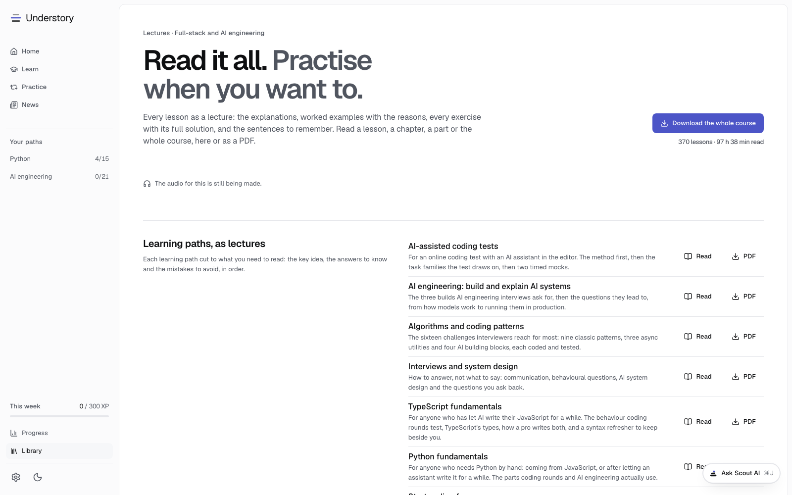
  </picture>
</p>

- **Any scope.** Read one lesson, a chapter with its revision sheet, a part, a path or the
  whole course, at `/lectures`.
- **PDF.** Each scope prints to its own PDF at build time.
- **Audio.** Each scope has a narrated playlist that remembers where you stopped, and
  downloads as an audiobook with chapters.

## Practise the real test

Most employers send a timed online coding test first, often with an AI assistant built in.
Understory has an AI-assisted coding simulator of it, under **Coding tests**. It looks,
runs and scores like the real thing, so on the day nothing is new.

<picture>
  <source media="(prefers-color-scheme: dark)" srcset="docs/assets/readme/online-test-dark.png">
  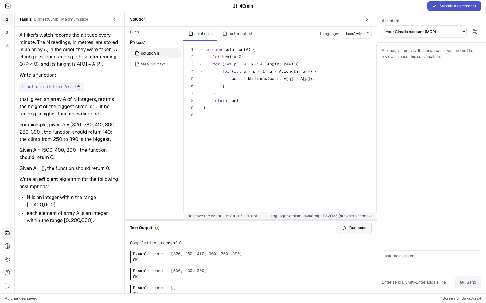
</picture>

- **The same flow.** An intro page, the tour, one clock for every task that never pauses,
  and a single Submit. When the time runs out, your code is submitted as it stands.
- **The same IDE.** The task, a Files tree with `test-input.txt` for your own cases, one
  solution per language, resizable panels, Vim mode, and Run code on F9.
- **The same output.** `Example test: [1, 2]`, `WRONG ANSWER (got 1 expected 4)`,
  `Returned value:`, timeouts and runtime errors, word for word.
- **The same scoring.** Hidden correctness and performance tests. A brute force keeps its
  correctness and loses its performance, as it does on the real one.
- **An AI assistant**, like the one employers can switch on, running on your own Claude.
  Every prompt goes into the report.
- **Guided mode.** A coach walks each task step by step: what to read first, what to ask
  the AI and why, what to write yourself, what to let the AI write, when to optimise and
  when to submit. The build proves every guide ends in a solution that scores 100%.
- **30 original tasks** across the classic assessment topics, in JavaScript, TypeScript
  and Python, with 6 preset tests, 120-minute training on any task, and custom tests.

The assistant is Scout, on the same connection to your own Claude
([Meet Scout](#meet-scout-your-ai-tutor)). Here it knows the task, your code and the last
output, and the reviewer reads the whole conversation.

After you submit, the report shows you what a reviewer sees: every hidden test and its
verdict, the detected time complexity, a replay of your code, the integrity signals and
the assistant transcript.

<picture>
  <source media="(prefers-color-scheme: dark)" srcset="docs/assets/readme/online-test-report-dark.png">
  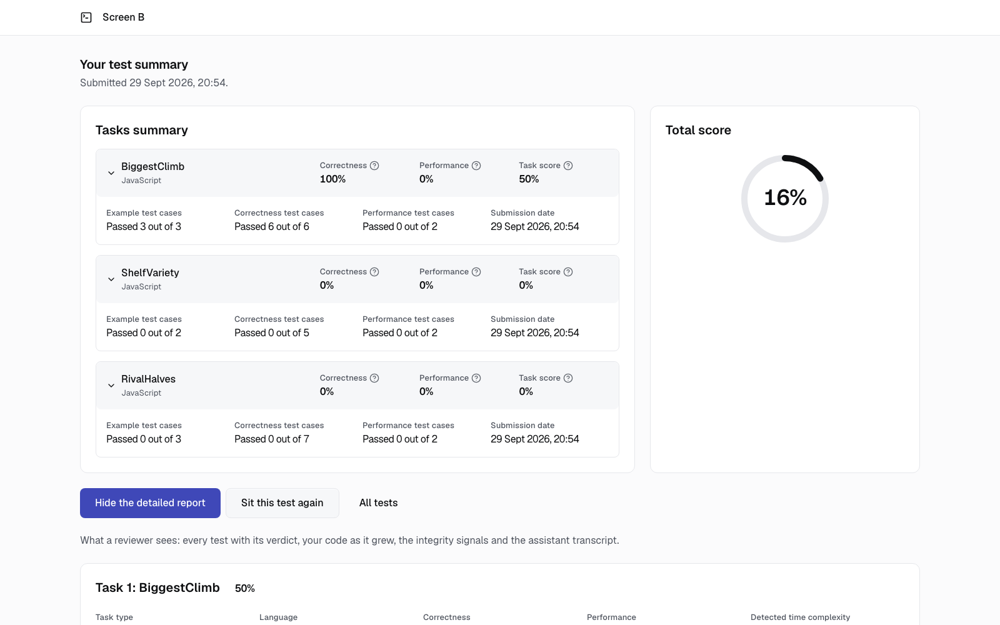
</picture>

<sub>Understory is not affiliated with any assessment platform. The simulator rehearses the
format; the tasks and the code are our own.</sub>

## Keep up with the field

AI research moves faster than any course can be rewritten. A new model, method or tool
lands every week, and it is easy to lose track of what matters. Understory has a news
section for that: a short daily digest, plus a weekly and a monthly one, under **News**.

- **Where the news comes from.** 41 hand-checked sources, listed in
  [`content/feeds.yaml`](content/feeds.yaml): the AI labs and researchers (OpenAI, Google
  DeepMind, Hugging Face, Simon Willison, Sebastian Raschka, Lilian Weng, Import AI), the
  web platform and the tools the course teaches (web.dev, WebKit, Chrome, React, Next.js,
  Node.js, TypeScript, PostgreSQL), engineering and security writing (The Pragmatic
  Engineer, Martin Fowler, Julia Evans, Jepsen, PortSwigger, Trail of Bits), plus Hacker
  News and arXiv.
- **How it is picked.** Each morning a scheduled job fetches the sources, drops anything
  older than 72 hours, merges duplicates, and scores what is left by topic, source,
  engagement and recency. The best dozen become the day's edition.
- **How it is explained.** Every item gets a brief in a fixed shape: what happened, why it
  matters, and the two to four key concepts behind it. Each links to the lessons underneath
  it, so a headline about a new attention trick leads to the lesson on how models work.
  With an Anthropic key the briefs are written by a model; without one they are drawn from
  the source text.

The pipeline is a plain Node script, so it runs just as well from a timer on a server. The
details are in [`SIGNAL.md`](docs/SIGNAL.md).

## Run it

You need Node 24 and pnpm.

```sh
git clone https://github.com/vieanderes/understory.git
cd understory
nvm use            # Node 24
pnpm install
pnpm dev           # http://localhost:3000
```

`pnpm dev` compiles the lessons, Pyodide, the TypeScript checker and Postgres before the
server starts, so the first run takes a minute.

```sh
pnpm check:fast    # the everyday check, about a minute
pnpm check         # everything, before a release: every solution, coverage, build
pnpm test:e2e      # Playwright on desktop Chromium and phone WebKit, with axe
```

Deployment to Vercel or to your own server with Docker and Caddy is in
[`docs/DEPLOYMENT.md`](docs/DEPLOYMENT.md). The app needs no environment variables. To
connect Claude to the simulator's assistant on Vercel, add a Redis store (see
`.env.example`).

## How it is built

| Layer               | Choice                                                                                                       |
| ------------------- | ------------------------------------------------------------------------------------------------------------ |
| App                 | Next.js 16 and React 19, TypeScript throughout, Tailwind on design tokens                                    |
| Domain              | `src/core`, framework-free: no React, Next, Node or browser globals, enforced by ESLint and its own tsconfig |
| Progress            | An event log of facts. XP, mastery, ranks and the weekly goal are derived by a reducer and never stored      |
| Scheduling          | FSRS for spaced review, with a mastery model per concept                                                     |
| Code in the browser | JavaScript in a sandboxed worker, TypeScript checked live, Python on Pyodide, SQL on PGlite (Postgres 18)    |
| Editor              | CodeMirror 6, with a phone mode and an exam profile with Vim mode                                            |
| Online tests        | An AI-assisted coding simulator. Each case runs alone in the sandbox and is judged by hash outside it        |
| Assistant           | Your Claude account through an MCP server, your own Anthropic key, or Claude Code on your machine            |
| Storage             | IndexedDB on the device, behind a port, so a sync adapter can replace it                                     |
| Offline             | A service worker built after each build, and a course download in Settings                                   |
| Content             | Lessons in YAML, checked by a zod schema and a validator that runs every solution against its tests          |
| iOS                 | `ios/UnderstoryKit`, a Swift package that reads the same content bundle. The app is in progress              |

The quality bar is part of the build, not a guideline.

- **Tests.** Domain rules are written test first, and `src/core` keeps 95% coverage.
- **Accessibility.** Every route passes axe (WCAG 2.2 AA) in both themes in the end-to-end suite.
- **Design laws.** Colours, sizes and radii come from tokens only. A unit test fails the build
  on an arbitrary value, a literal colour, a gradient or an emoji used as an icon.
- **Writing.** `pnpm content:readability` measures every lesson against the
  [writing guide](docs/WRITING-GUIDE.md): short sentences, one idea per screen, explanation
  before any question.

Every decision, with its reason, is in [`docs/ARCHITECTURE.md`](docs/ARCHITECTURE.md).

<details>
<summary><b>Repository map</b></summary>

```text
content/
  course/<chapter>/<lesson>/   lesson.yaml, notes.yaml, and solutions
  tracks/                      the seven learning paths
  online-tests/                the simulator's tasks and preset tests
  capstones/                   worked solutions for each part's capstone
  feeds.yaml                   the news sources
src/
  core/                        domain rules: mastery, scheduling, XP, exams. Framework-free
  adapters/                    storage, the code sandbox, news fetching
  features/                    one folder per screen or player
  app/                         routes
  styles/tokens.css            every colour, size, radius and typeface
scripts/                       content compiler, validator, PDF and audio builds
tests/                         unit, process and end-to-end suites
ios/                           the Swift package
docs/                          the documents below
```

</details>

## Documents

| Document                                          | What it answers                                             |
| ------------------------------------------------- | ----------------------------------------------------------- |
| [`ARCHITECTURE.md`](docs/ARCHITECTURE.md)         | Every decision, the choice and the reason                   |
| [`LEARNING-SCIENCE.md`](docs/LEARNING-SCIENCE.md) | The evidence, the core loop, the rules for mastery and XP   |
| [`CURRICULUM.md`](docs/CURRICULUM.md)             | Every chapter and lesson, and why each chapter matters      |
| [`CONTENT-GUIDE.md`](docs/CONTENT-GUIDE.md)       | How to write a lesson                                       |
| [`WRITING-GUIDE.md`](docs/WRITING-GUIDE.md)       | How lesson text should read                                 |
| [`DESIGN.md`](docs/DESIGN.md)                     | Tokens, type, motion and the page review checklist          |
| [`MOBILE-EDITING.md`](docs/MOBILE-EDITING.md)     | Writing code on a phone                                     |
| [`SANDBOX.md`](docs/SANDBOX.md)                   | How learner code runs safely in the browser                 |
| [`ONLINE-TEST.md`](docs/ONLINE-TEST.md)           | The online-test simulator: how it matches, how to add tasks |
| [`SYNC-PROTOCOL.md`](docs/SYNC-PROTOCOL.md)       | How devices will sync, designed and not yet built           |
| [`SIGNAL.md`](docs/SIGNAL.md)                     | The news feed: sources, scoring, briefs                     |
| [`ROADMAP.md`](docs/ROADMAP.md)                   | Where it stands and what comes next                         |
| [`AGENTS.md`](AGENTS.md)                          | The laws of the codebase, for people and coding agents      |
| [`CONTRIBUTING.md`](CONTRIBUTING.md)              | How to contribute, and what a good pull request looks like  |

## Where it is going

Understory is not finished, and I do not want it to be. I will keep building it.

- **New ideas become lessons.** When I learn a method or concept in AI engineering, or
  anywhere else in the craft, that belongs in the course, I will add it and mark it as new,
  so returning learners see what changed without hunting for it.
- **A more premium feel.** I will keep steering the design towards a calmer, more crafted
  and more recognisable look, until the brand is as clear as the content.
- **Scout and the simulator** will grow with the tools they mirror.

What is next, in order, is in [`ROADMAP.md`](docs/ROADMAP.md).

## Contributing

Contributions are very welcome, wherever you think they help: a correction, a clearer
explanation, a new lesson or a whole course, a new UI feature, a better lab, or an
improvement to Scout's harness or its MCP server. First contributions are welcome too; look
for the `good first issue` label.

### How a contribution flows

1. **Small fix?** A typo, a broken link, an obvious bug: open a pull request straight away.
2. **Anything bigger?** A new lesson, a feature, a change to a rule or a schema: open an
   issue first and describe the problem and the shape you have in mind. Agreeing on it first
   saves you from building something that cannot be merged.
3. **Build it** on a branch, one change per pull request, and run the checks below.
4. **Open the pull request** with the template filled in. Drafts are welcome for early
   feedback.
5. **Review.** A maintainer reviews every pull request, usually within a week. Expect
   questions; they are about the work, never about you. It is squashed into one commit on
   merge.

### The rules that keep it consistent

- **Everywhere.** Follow the laws in [`AGENTS.md`](AGENTS.md). Match the code around you.
  Rules in `src/core` are written test first and keep 95% coverage. British English, no
  marketing language.
- **Lessons.** Follow [`CONTENT-GUIDE.md`](docs/CONTENT-GUIDE.md) and
  [`WRITING-GUIDE.md`](docs/WRITING-GUIDE.md): one idea per screen, explain before you test,
  no mental arithmetic. Plain, generic examples, never a real company's product. Every
  solution passes its tests and every fact has a checked source. Say when a lesson is new,
  so it can be marked as new.
- **Interface.** Design tokens only ([`DESIGN.md`](docs/DESIGN.md)): no literal colours,
  arbitrary values, gradients or emoji icons. Check every changed screen at 390, 768, 1024
  and 1440 px, in light and dark, and attach screenshots. Every route passes axe (WCAG 2.2
  AA).
- **The README.** Please help keep it current. If your change adds or alters something the
  README describes or shows, update that part in the same pull request, including the
  screenshots. That way it never falls behind, and it does not rest on one person.
- **Scout and MCP.** Scout runs on the learner's own Claude: never a server-side key, never a
  paid call on a visitor's behalf, never a stored learner key. It stays out of anything that
  measures the learner. Start at `src/core/ports/assistant.ts` and
  [`ONLINE-TEST.md`](docs/ONLINE-TEST.md), section 6.

### Before you open a pull request

```sh
pnpm check:fast                            # every change, about a minute
pnpm test:e2e tests/e2e/<name>.spec.ts     # any screen you changed
```

A change to the build, the content pipeline, the solution gates or the code runners needs
the full `pnpm check` and `pnpm test:e2e`.

### Commits and pull requests

- **Commit subject:** imperative, what changed and where, no full stop, under 72 characters:
  `Add hint ladder to code-challenge steps`. Add a short body only when the reason is not
  obvious.
- **One logical change per commit and per pull request.** A fix and a refactor are two.
- **Pull request title** reads like a commit subject; the description says what, why, how
  you tested it, and links the issue it closes.
- Answer review comments with new commits rather than force-pushes, so the conversation
  stays readable.

### AI help, licensing and conduct

- **AI-assisted contributions are fine,** as long as you have read, run and understood every
  line you submit, and can explain it in review. Unchecked generated code will be closed.
  Understanding the code is the whole point of this project.
- **Licensing:** by contributing you agree that code, design and docs are licensed under
  MIT, and lesson content under CC BY-NC-SA 4.0, like the rest of the repository.
- **Conduct:** everyone follows the [code of conduct](CODE_OF_CONDUCT.md). Report security
  issues privately as described in [`SECURITY.md`](SECURITY.md), never in a public issue.

The full guide, with setup and more detail for each area, is in
[`CONTRIBUTING.md`](CONTRIBUTING.md).

## Support

Understory is free and stays free. If it has helped you and you would like to give something
back, the **Sponsor** button at the top of this repository takes you to my Ko-fi page. Every
coffee gives me time to keep writing lessons and looking after the project. Thank you.

## Licence

- **Code, design and documentation** are under the [MIT License](LICENSE).
- **Lessons** in `content/` are under [CC BY-NC-SA 4.0](content/LICENSE). Share and adapt
  them with credit, not for commercial use, and release what you adapt under the same
  licence. The credit line to use is at the top of [`content/LICENSE`](content/LICENSE).
- **Bundled open-source packages** in the sandbox runtimes keep their own licences, listed
  in [`THIRD_PARTY_NOTICES.md`](THIRD_PARTY_NOTICES.md).

<br>

<p align="center">
  <sub>Found a mistake in a lesson? <a href="https://github.com/vieanderes/understory/issues">Open an issue</a>.</sub>
</p>
